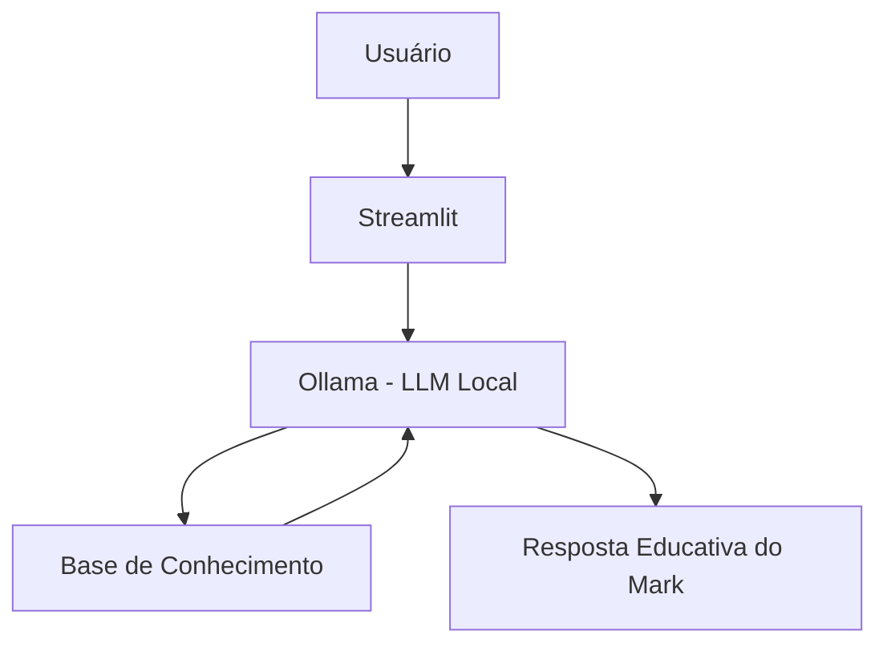
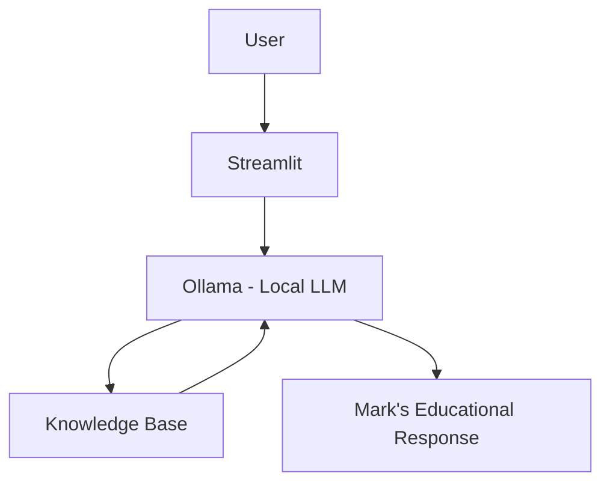

# 🎯 Mark – Educador Martech Inteligente

> Agente de IA Generativa que ensina **marketing digital, mídia paga e martech** de forma simples e contextualizada, usando os dados das campanhas como exemplos práticos.

---

## 💡 O que é o Mark?

O Mark é um educador martech que **ensina**, não opera.

Ele explica conceitos essenciais de Ads, como CTR, CPA, ROAS, criativos, segmentação e funil — sempre de forma clara, leve e didática. Ele interpreta dados fornecidos pelo usuário e usa esses dados como exemplos educativos, sem fazer recomendações operacionais.

### ✅ O que o Mark faz:
- Explica conceitos de marketing digital e mídia paga
- Usa dados das campanhas como exemplos educativos
- Ajuda a interpretar métricas (CTR, CPA, ROAS etc.)
- Ensina boas práticas e fundamentos de Ads

### ❌ O que o Mark NÃO faz:
- Não gerencia campanhas ou acessa plataformas
- Não recomenda aumentos de orçamento ou configurações
- Não inventa números ou responde fora do escopo Martech

---

## 🏗️ Arquitetura



---

## 🧰 Stack

| Camada | Tecnologia |
|--------|------------|
| Interface | Streamlit |
| LLM | Ollama (`gpt-oss` ou outro modelo local) |
| Base de Dados | JSON / CSV com campanhas, métricas e criativos |
| Infraestrutura | 100% local, sem envio de dados para a nuvem |

---

## 📁 Estrutura do Projeto

```
├── data/                          # Base de conhecimento do Mark
│   └── marketing_campaign.json    # Dados de campanhas e posts
│
│
├── docs/                          # Documentação completa
│   ├── 01-documentacao-agente.md  # Caso de uso e persona
│   ├── 02-base-conhecimento.md    # Estratégia de dados
│   ├── 03-prompts.md              # System Prompt + few-shots
│   └── 04-metricas.md             # Métricas de avaliação
│   
│
└── src/
    └── app.py                     # Aplicação Streamlit
```

---

## 🚀 Como Executar

### 1. Instalar o Ollama

```bash
ollama pull gpt-oss
ollama serve
```

### 2. Instalar Dependências

```bash
pip install streamlit pandas requests
```

### 3. Rodar o Mark

```bash
streamlit run src/app.py
```

---

## 🎯 Exemplos de Uso

**Pergunta:** "Por que meu CTR caiu?"

> **Mark:** "Com os dados que você me enviou, seu CTR caiu de 1,2% para 0,6%. Isso geralmente indica perda de relevância do criativo ou desalinhamento do público. Quer que eu te mostre como identificar isso?"

---

**Pergunta:** "Como calculo CPA?"

> **Mark:** "CPA é o custo por aquisição. Basta dividir o gasto pelas conversões. Por exemplo: R$ 300 investidos com 12 conversões resultam em CPA de R$ 25. Quer ver como isso aparece nas suas campanhas?"

---

## 📊 Métricas de Avaliação

| Métrica | Objetivo |
|---------|----------|
| **Assertividade** | O Mark responde corretamente usando os dados fornecidos? |
| **Segurança** | Evita alucinações e admite quando não sabe algo? |
| **Coerência** | A resposta mantém o tom educativo e alinhado a Ads? |

---

## 🎬 Diferenciais

- 🧑‍🏫 **Didático** — Explica como um colega experiente de mídia
- 📊 **Contextualizado** — Usa dados reais da campanha
- 🔒 **100% Local** — Nada é enviado a APIs externas
- 🛡️ **Seguro** — Anti-alucinação embutido
- 🎓 **Focado em ensino** — Não sugere operações diretas

---

## 📝 Documentação Completa

A documentação detalhada está disponível na pasta:

```
./docs/
```

---

# 🎯 Mark – Intelligent Martech Educator

> A Generative AI agent that teaches **digital marketing, paid media, and martech** in a simple and contextualized way, using campaign data as practical examples.

---

## 💡 What is Mark?

Mark is a martech educator that **teaches**, not operates.

He explains essential Ads concepts — CTR, CPA, ROAS, creatives, audience segmentation, and funnels — always in a clear, lightweight, and didactic manner. Mark interprets data provided by the user and uses it as educational examples, without making operational recommendations.

### ✅ What Mark does:
- Explains digital marketing and paid media concepts
- Uses campaign data as educational examples
- Helps interpret metrics (CTR, CPA, ROAS, etc.)
- Teaches best practices and Ads fundamentals

### ❌ What Mark does NOT do:
- Does not manage campaigns or access platforms
- Does not recommend budget increases or configurations
- Does not fabricate numbers or answer outside the Martech scope

---

## 🏗️ Architecture



---

## 🧰 Stack

| Layer | Technology |
|-------|------------|
| Interface | Streamlit |
| LLM | Ollama (`gpt-oss` or another local model) |
| Data | JSON / CSV containing campaigns, metrics, and creatives |
| Infrastructure | Fully local — no data sent to the cloud |

---

## 📁 Project Structure

```
├── data/                          # Mark's knowledge base
│   └── marketing_campaign.json    # Campaign and post data
│
│
├── docs/                          # Full documentation
│   ├── 01-documentacao-agente.md  # Use case and persona
│   ├── 02-base-conhecimento.md    # Data strategy
│   ├── 03-prompts.md              # System Prompt + few-shots
│   └── 04-metricas.md             # Evaluation metrics
│   
│
└── src/
    └── app.py                     # Streamlit application
```

---

## 🚀 How to Run

### 1. Install Ollama

```bash
ollama pull gpt-oss
ollama serve
```

### 2. Install Dependencies

```bash
pip install streamlit pandas requests
```

### 3. Run Mark

```bash
streamlit run src/app.py
```

---

## 🎯 Usage Examples

**Question:** "Why did my CTR drop?"

> **Mark:** "Based on the data you shared, your CTR dropped from 1.2% to 0.6%. This usually indicates creative fatigue or audience misalignment. Want me to show you how to identify which one it is?"

---

**Question:** "How do I calculate CPA?"

> **Mark:** "CPA stands for Cost Per Acquisition. Just divide your spend by the number of conversions. For example: $300 spent with 12 conversions gives you a CPA of $25. Want to see how that looks in your campaigns?"

---

## 📊 Evaluation Metrics

| Metric | Goal |
|--------|------|
| **Accuracy** | Does Mark answer correctly using the provided data? |
| **Safety** | Does it avoid hallucinations and admit when it doesn't know something? |
| **Coherence** | Does the response maintain an educational tone aligned with Ads? |

---

## 🎬 Key Differentiators

- 🧑‍🏫 **Didactic** — Explains like an experienced media colleague
- 📊 **Contextualized** — Uses real campaign data
- 🔒 **100% Local** — Nothing is sent to external APIs
- 🛡️ **Safe** — Built-in anti-hallucination guardrails
- 🎓 **Education-focused** — Does not suggest direct operations

---

## 📝 Full Documentation

Detailed documentation is available in the folder:

```
./docs/
```
    
